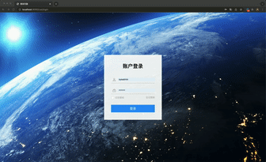

# h-cas
author: husiyi  2021.11.09

自建单点登录CAS体系，解决iframe 下因为无法传递cookies导致无法单点登录问题。
前端使用[Layui](http://layui-doc.pearadmin.com/doc/index.html)

### 与原开源 cas 相比

- 使用spring boot + thymeleaf 前后端不分离体系,更加容易修改集成。
- 使用mybatis plus 作为持久层。
- 使用localStorage 替代cookies，解决iframe下 浏览器拦截cookies,子系统无法完成单点登录的情况。
- 多种登录方式快速扩展,简化原cas体系。
- 接入API 与 cas-client 一致，接入方案与开源cas 一致。
- 替换原cas 的spring flow 体系，通俗易懂。

### 代码清单
- 后端
    - CasProperties  配置类,参考开源cas标准
    - RedisPrefixConstant  redis 存储的前缀
    - AccountLoginController  单点登录实现
    - CasServiceController 客户端服务处理
    - LoginController 基础页面跳转逻辑,不必修改
    - LogoutController 登出页面跳转逻辑
    - ServiceValidateController  客户端ticket兑换登录信息处理类
    - AccessFilter 客户端配置功能的拦截器,确保只有超管才能编辑客户端信息
    - CasCommonService 单点登录基础服务

- 前端
    - login.html  默认登录页面
    - logout.html 登出处理页,不必修改
    - errorService.html 未注册的客户端处理页，不必修改
    - defaultSuccess.html 登录成功的默认跳转页面
    - CasServiceList.html 客户端信息管理页面
- 数据库
    - baseAuth.sql  基础的用户,权限信息表
    - cas_service_dm.sql  达梦版本的客户端管理表 
   - cas_service_mysql.sql mysql8 版本的客户端管理表
- sdk
    - cas-client-sdk.zip 客户端接入示例,包括传统spring mvc,spring boot ,前后端分离等情况
    - pomwar.war  使用web中间件部署的依赖
### 二次开发指南
-  新增登录实现
    - 后端参考:AccountLoginController.java,校验获取用户信息后,调用casCommonService
      生成包含ticket和tgt 的 dto返回给页面

    - 参考login.html,其中casBase.js 是封装好的cas 前端处理实现,其余自实现登录校验逻辑

